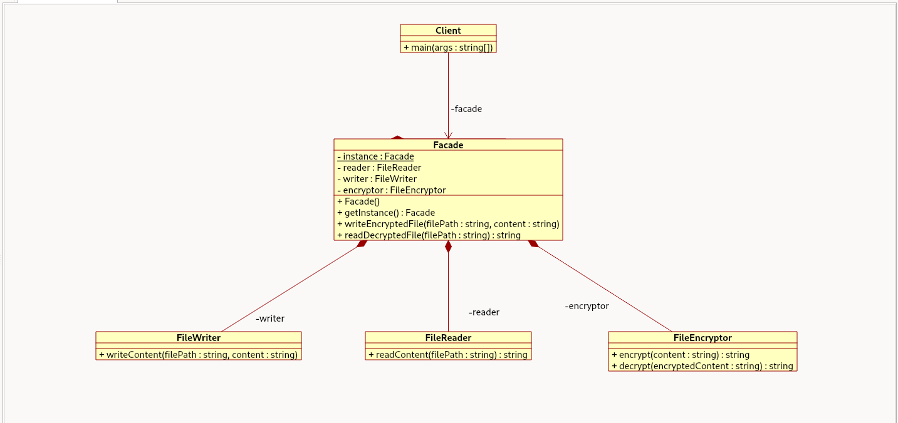

# FacadeEncryptor

Este proyecto implementa el patrón de diseño **Facade (Fachada)** en Java, diseñado para simplificar el proceso de encriptación, desencriptación, lectura y escritura de archivos.

## Diagrama de Clases (UML)

El siguiente diagrama ilustra la arquitectura del proyecto, basándose en el patrón Facade:

### Descripción de los Componentes

*   **`Client`**: Clase principal que interactúa con el sistema utilizando exclusivamente la `Facade`. No conoce ni se acopla a las clases internas del subsistema.
*   **`Facade`**: Implementada como un **Singleton**, actúa como un intermediario que proporciona una interfaz simplificada. Expone los métodos `writeEncryptedFile` y `readDecryptedFile`, orquestando internamente a los demás componentes.
*   **`FileReader`**: Encargado exclusivamente de leer el contenido de texto desde un archivo.
*   **`FileWriter`**: Encargado exclusivamente de escribir contenido de texto hacia un archivo.
*   **`FileEncryptor`**: Contiene la lógica para encriptar y desencriptar cadenas de texto.
